# 移动C盘文件夹

在日常生活中，我们会遇到各种情况需要把C盘里的文件夹移动到其他盘。

请注意：网上一部分教程会教我们直接编辑注册表。如果你不知道自己在对注册表做什么，我们不推荐任何直接编辑注册表的操作！

## 正常方法

在C盘里，我们比较方便移动的是“用户”文件夹内，个人用户目录下的“**桌面**”（Desktop）、“**下载**”（Downloads）、“**文档**”（Documents）、“**图片**”（Pictures）、“**音乐**”（Music）、“**视频**”（Videos）六个文件夹。这几个文件夹一般也固定在文件管理器的左侧。

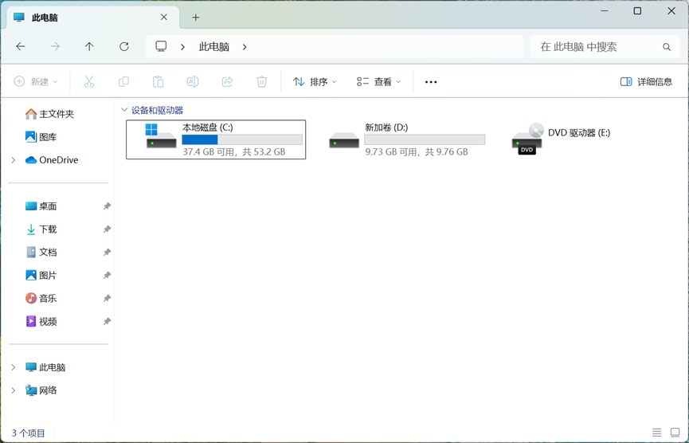

其中，“桌面”文件夹保存着我们的桌面上的文件；“下载”文件夹是一些软件的默认下载路径；“文档”文件夹包含QQ和微信聊天记录的默认保存位置，还有其他的一些软件的存储；“图片”和“视频”文件夹是 Windows 自带的截图工具截图或录屏的保存位置。“音乐”文件夹也是一些软件的默认保存位置，相较前面几个文件夹不常用。

想要移动这几个文件夹非常简单。在移动之前，建议关闭所有打开的程序，避免程序占用文件夹中的文件。首先，我们可以在D盘新建一个目标文件夹。请注意：移动前的文件夹和移动后的文件夹必须一一对应，非常不建议把多个文件夹移动到同一个文件夹内。同时，也不要移动到盘的根目录下。

以移动“文档”文件夹为例。我们可以在D盘新建一个名为“Documents”的文件夹。这里的名称可以自定，但是尽量不要使用中文。文件夹移动后它显示的名字会自动变成中文。

新建好文件夹之后，我们就可以进行“移动”操作。我们可以在文件资源管理器左侧找到对应文件夹。如果之前已经把这几个文件夹在左侧取消固定了，可以输入“%userprofile%”，进入自己的用户文件夹以后找到这几个文件夹。

找到文件夹之后，我们右键对应的文件夹，点击“属性”。

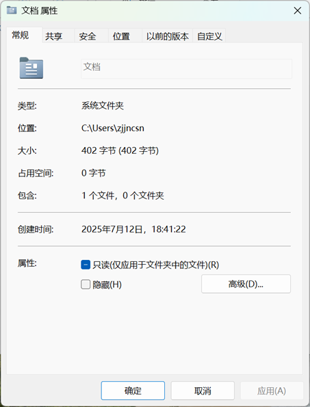

点击“位置”选项卡，再点“移动”。之后在弹出的窗口里选择需要移动到的位置即可。然后点击右下角“应用”。

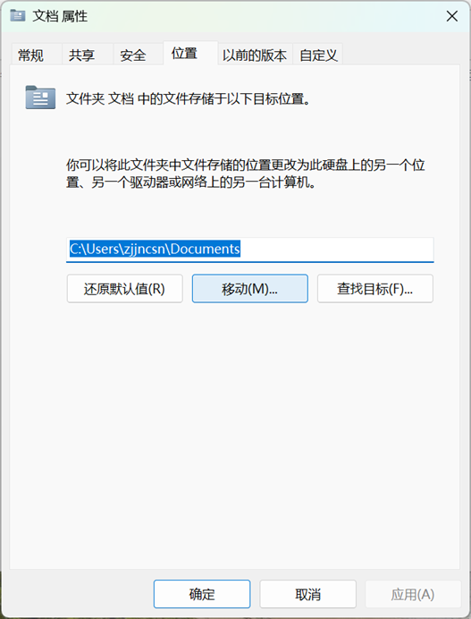

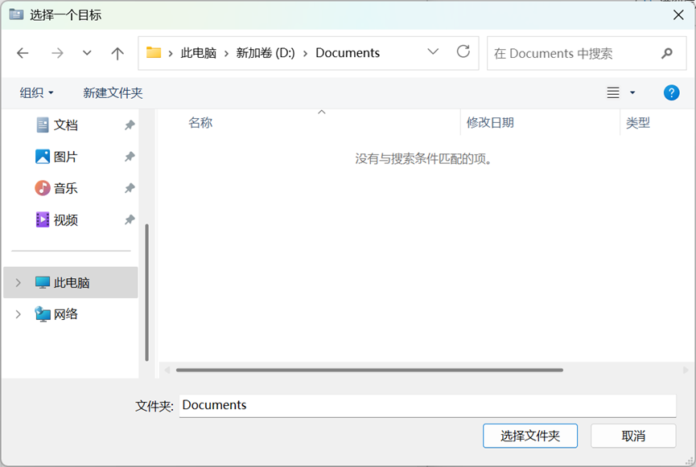

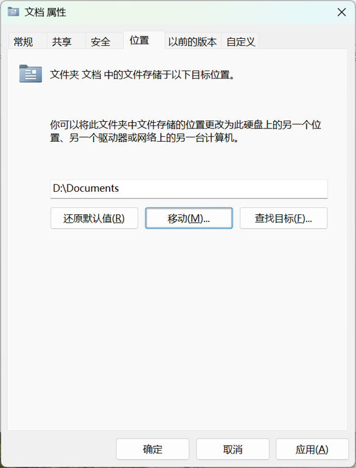

点击“应用”以后会弹出来类似于这样的弹窗，点击“是”即可。注意，“应用”相当于“保存”，点击“应用”以后再点“取消”是不会还原回原来的状态的。

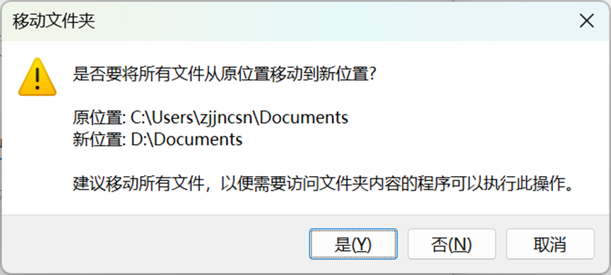

之后系统会将原来文件夹的文件移动到新的文件夹。移动之后使用这些文件的应用一般会自动找到新路径，不需要做额外的设置。

那如果，我们忘记新建文件夹了，一不小心在这里把“文档”文件夹直接移到了D盘根目录下。D盘下又有其他的该怎么办呢？
这时候在可以点击“恢复默认值”，在点击“应用”后的弹窗中选“否”。之后将原“文档”文件夹里面的内容手动复制回原路径。

## 救急方法

还有一种情况，修改“桌面”文件夹路径到一个不合适的位置后导致桌面崩溃，文件管理器也无法直接打开。

这时候可以考虑直接修改注册表，将其改为原来的位置。

具体操作为：

快捷键Win + R，在弹出来的框里输入“regedit”。如果弹出不了，则可以按下Ctrl + Shift + Esc，在弹出来的任务管理器中点击“运行新任务”，输入“regedit”。

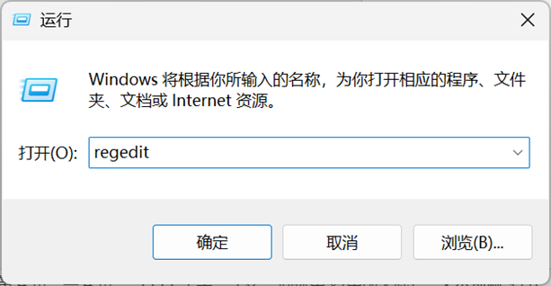

之后，在打开的窗口里打开
```
计算机\HKEY_CURRENT_USER\Software\Microsoft\Windows\CurrentVersion\Explorer\Shell Folders
```
，然后可以参考下面这张图来还原自己的注册表项。

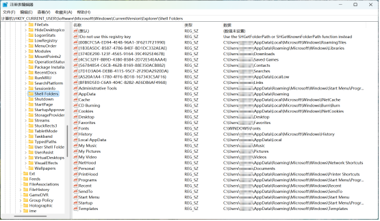

之后，再打开
```
计算机\HKEY_CURRENT_USER\Software\Microsoft\Windows\CurrentVersion\Explorer\User Shell Folders
```


这样即可恢复默认路径。如果原文件夹仍然显示为对应名字，可以在文件管理器的“选项”里选择显示隐藏的文件和取消隐藏受保护的系统文件，并删除“desktop”文件（在显示后缀名的电脑上为“desktop.ini”），文件夹的名字和图标便会恢复默认。

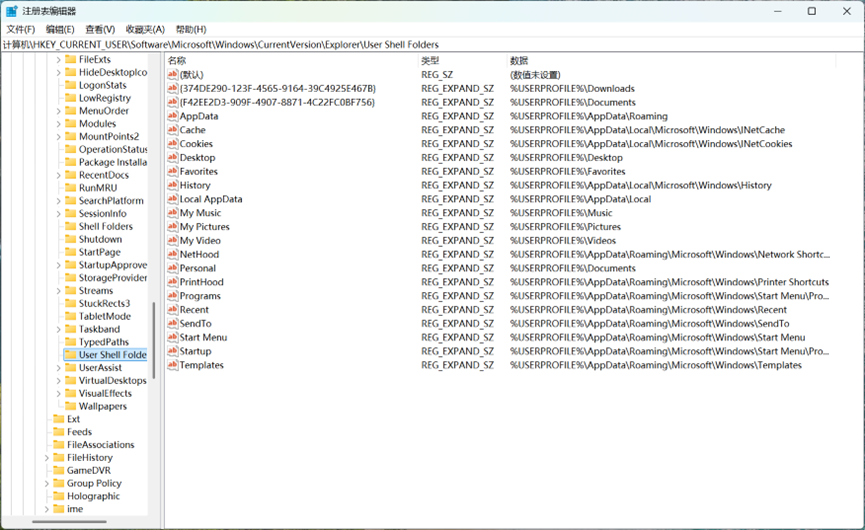

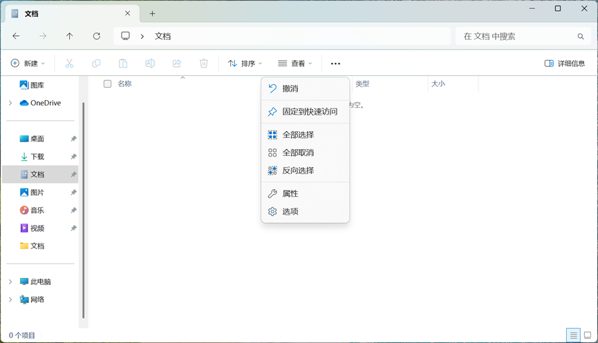

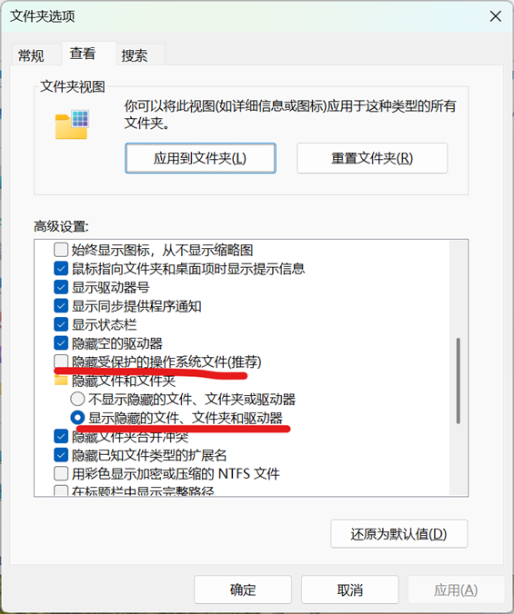

在操作完成之后再将“文件夹选项”恢复为默认值即可。