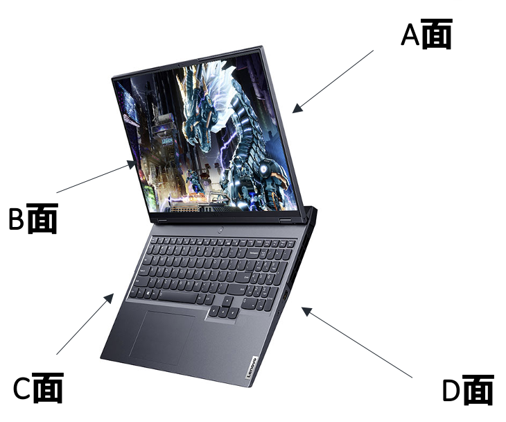
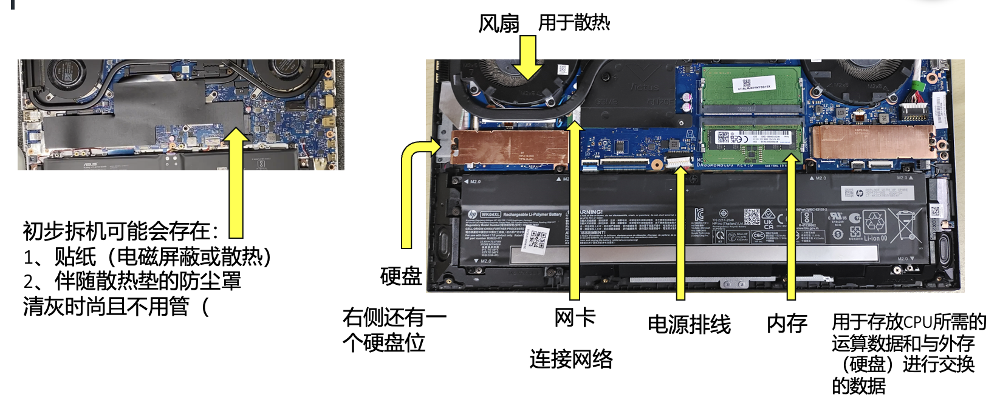
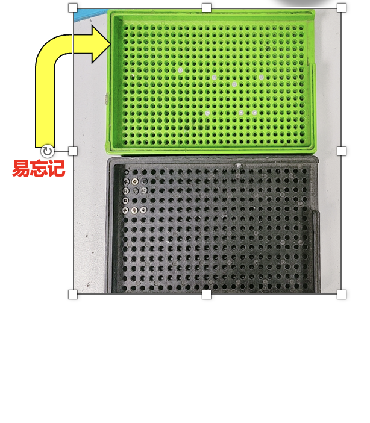
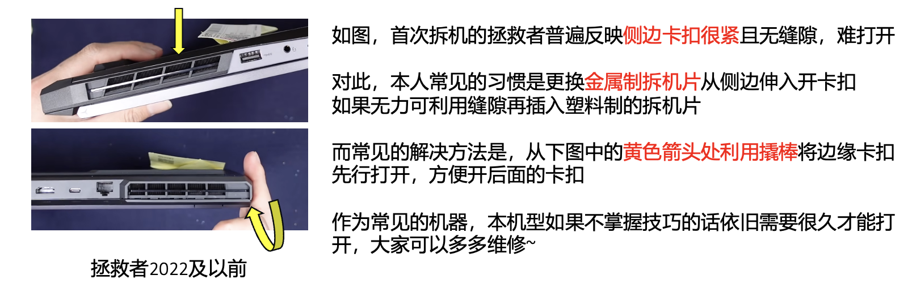
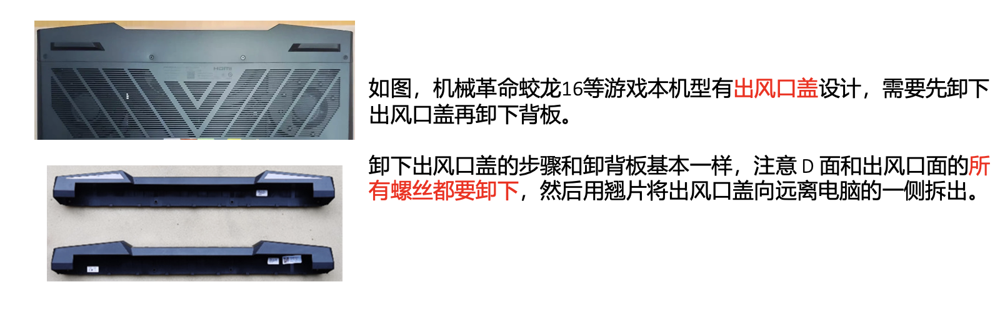
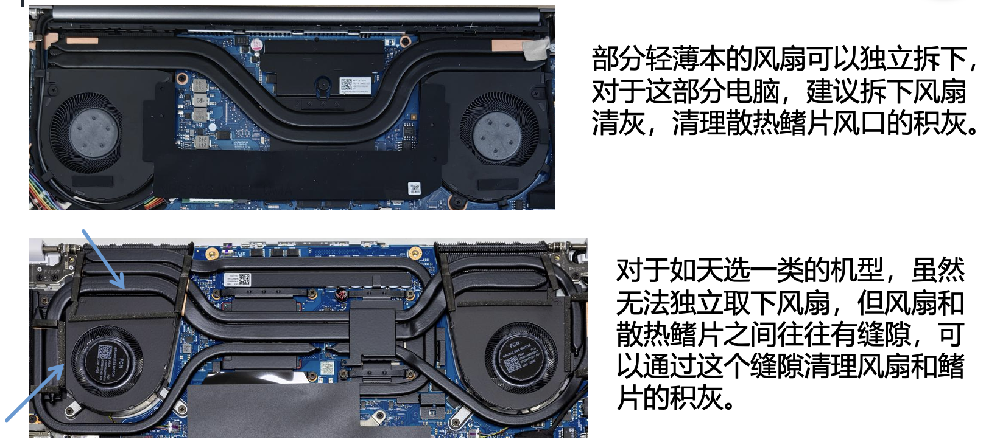
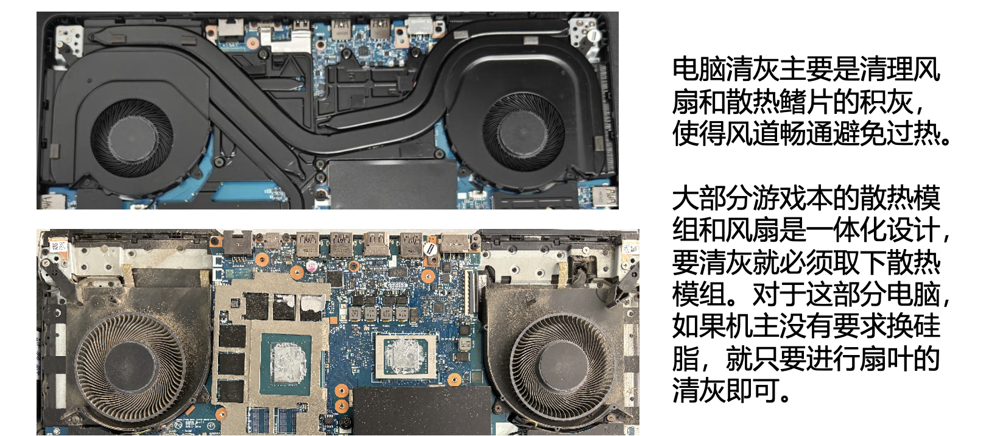

# 拆机与清灰
## before 拆机的基础知识😎

!!! note "基础知识"
    <table>
    <tr>
        <td width="50%" valign="top">
            <h3><strong>一、笔记本的A、B、C、D面</strong></h3>
                一般来说，A面指的是屏幕顶盖，B面指屏幕面，C面指键盘面，D面指后盖
            <h3><strong>二、为什么部分机型不接受拆机？</strong></h3>
                部分机型拆机难度大且易损坏（如DELL主板反装）
            <h3><strong>三、电脑的硬件知识</strong></h3>
            <ul>
                <li>简单来说，电脑所有的物理的零件都是电脑的硬件。</li>
                <li>电脑的硬件主要包括——主板、CPU、显卡、内存、硬盘、散热模块、电源等。</li>
            </ul>
        

        </td>
        <td width="50%" valign="top">
        
        </td>
    </tr>
    </table>

**清灰意味着拆机，那么我们必然会接触硬件。**

## 硬件知识
??? note "硬件示意图"
    
    Tips：大部分笔记本电脑的散热模块是热管+风扇的设计。他们压着CPU和显卡，在拆下热管和风扇前我们是看不到CPU和显卡芯片的。

## **拆机、清灰的一般流程😋**
??? note "一般流程"
    <table>
    <tr>
        <td width="50%" valign="top">
            <ul>
                <li>①观察后盖螺丝种类：十字？六角？并选择合适批头</li>
                <li>②戴好防静电手环，防止静电损坏机器</li>
                <li>③拧开后盖螺丝并牢记螺丝孔位置，放在螺丝盒中</li>
                <li>④使用撬片或者撬棒撬开后盖卡口，取下后盖</li>
                <li>⑤**断电！！！**（断排线或取电池）</li>
                <li>⑥用毛刷轻轻对风扇进行清灰</li>
                <li>⑦确认操作完成后，接回电源</li>
                <li>⑧盖上后盖。拧上螺丝（可选）</li>
                <li>⑨测试能否正常开机。如果不行则**首先怀疑自己是否忘接排线**</li>
                <li>⑩**拧好螺丝**，（千万不要忘记！！）交还机主，确认配件是否带走、更改工单状态。</li>
            </ul>
        </td>
        <td width="50%" valign="top">
        
        </td>
    </tr>
    </table>

**简单来说：防静电-开盖-断电-清灰-接回电源-盖后盖-确认开机-拧螺丝**
!!! danger "拆机警告⚠️"
    ①**严禁带电操作！！！**一定要记得断电！！！

    ②记好**每颗螺丝对应位置**，如果记错的话你可能会发现C面突出一段（

    ③验证开机结束后，一定要记得**拧上螺丝**！（此现象高发）

    ④如果出现**滑丝**现象，更换大口径的螺丝刀再次尝试，否则当螺纹消失后会拧不出

    ⑤虽然部分情况下蛮力是必要的，但是请**谨慎使用**！

    ⑥遇到解决不了的问题，建议让ldx来或者走保。

不要害怕劝退，有时劝退需果断！不要硬着头皮上去尝试解决不了的问题！

!!! warning "拆机注意事项"
    ①部分机型可能已经加入了后盖的光敏电阻检测（如ROG、天选4等）开盖后自动断电
        因此当你装完之后发现无法开机，**请不要慌张**，插上原装充电器之后再次尝试
    
    ②部分机器可能存在**弹簧螺丝**，若下螺丝时听见反复的“咔哒”声，确定其为弹簧螺丝之后，不必将其取下，可小心开后盖。（点名天选右下那颗）
    
    ③部分轻薄本可能存在脚垫下的**隐藏螺丝**，当你发现后盖上仍有很大阻力，请不要继续暴力开盖，将脚垫轻轻撬开寻找螺丝。如若无法确定可自行上网查询对应拆机视频。
      （当然阻力也有可能来自于后盖中央的卡扣，需要横拉或竖拉或者微微抖动笔记本后盖，请仔细判断）还有部分机型可能会在螺丝孔上贴贴纸作为保修标记，**请仔细排查**。
    
    ④ROG排线拆装：前端**轻推铁片**，或寻找电池上排线。
    如果你在装回ROG排线时出现轻微火花，机器可能并未损坏，属于设计问题。
    天选排线需要抬起，部分机型电池需要整个取下。

??? note "关于拆机，ldx有话说"
    首先，请大家不要去**害怕拆机**，机器的维修量是挺大的，你可能会碰见任何一种bt机型。

    在碰见不熟悉的机型时可以求助ldx或者自行上网查询拆机方法，但重点在于以后碰见这台机器要会修。

    **免责声明**：这里只是提供**本人认为**快速合理的拆机方法，具体拆机时**怎么好拆怎么拆、怎么安全怎么拆**！

    - **拆外壳**
  
    
    

    - **卸电源排线**
  
    
    

    还有部分轻薄本或是老机器可能**没有**电源排线，需要**直接下电池**！

??? note "关于清灰，ldx有话说"
  
    
    

    
    
    

    
