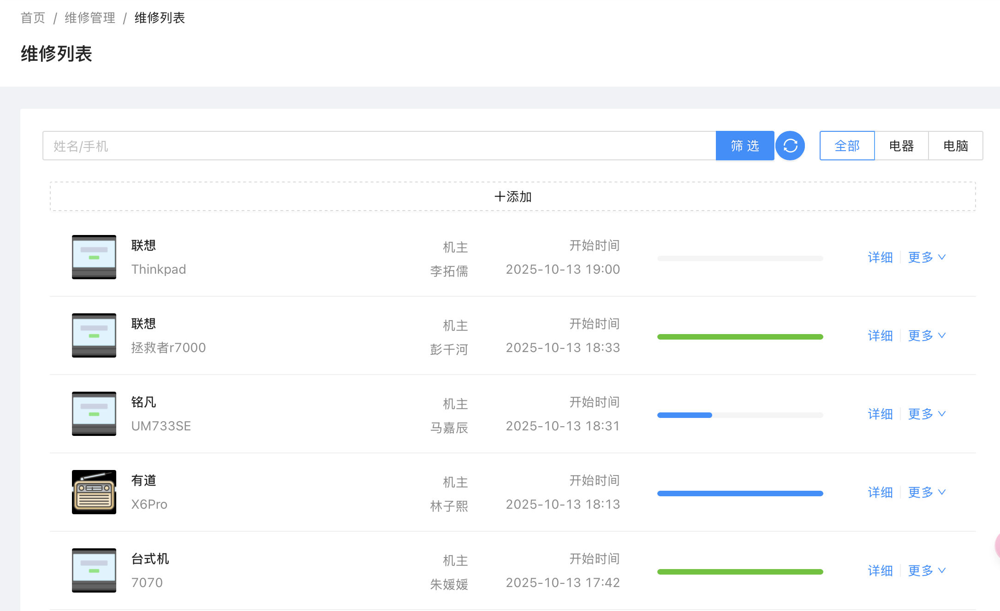
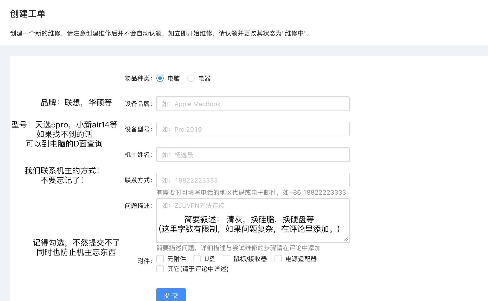

# 值班规范与实验室规范

## 值班规范 
- 及时进行**签到签退**（如果签到后忘记签退）可以联系认（人）字（资）部

- 某些型号的电脑无法提供硬件维修服务（如**苹果、戴尔、surface**）

- 接待机主时请保持**良好**的态度

- 拆机或进行类似操作时需**佩戴静电手环**并检查电脑是否已经断电

- 维修完成后请将维修工具等**归还原位**（尤其是**螺丝刀以及对应批头**）

- 如果进行了拆机，记得**填写值班记录单**

- **不要在值班期间摸鱼（严禁打游戏）(╬▔皿▔)╯，不要去自闭间或后排自习**

## 实验室规范
 ① 204是一间**实验室**，所以在204内同样需要**遵守浙大实验室的规范**

 ② 严禁在204内**吃东西**或带入**任何奶茶类无盖饮品！**（为你的安全着想）

 ③ 除非得到许可，请不要乱动（台钻、激光、服务器等）设备

## 维修流程 
- [工单平台](https://oreo.zjueva.net)

① 在Oreo上登记并创建工单

② 在Oreo上认领工单

③ 进行维修

④ 及时更改工单状态

Tips：欢迎在Oreo界面备注修机时遇到的问题，如果有认为值得记录的内容也可以备注到百科上

`204原则上不支持机器过夜，如有请备注并交接完全`

## 如果我无法解决问题。。。。。。
!!! warning "求助方式"
    ① 每班值班会有几个“老东西”，可以请他们帮忙

    ② 在[Wiki](wiki.zjueva.net)上会有一些维修记录可供参考 

    ③ 在**维修手册**（就是你现在点开的这个，探索探索，如果想来一起编辑，可以联系电脑部的技术副会或者内训腹部）上有维修教程可以速查

    ④ 如果实在无法解决，请告知机主我们无法维修

    **不必害怕劝退，在拆机后如果发现解决不了的问题，请详细告诉机主不可维修的原因并建议走保或者上维修店**

## 如果我翻车了。。。。。。
!!! danger "翻车处理"
    
    ①首先，协会不提倡进行高难度的维修。在遇到无法解决的故障时请让机主去专业电脑店维修。（所以注意好机器拿来维修时的原状况也是非常重要的）

    ②如果翻车了，请呼叫老东西们并与机主**协商**（注意不要作出承诺，不要说“我们会赔偿”，可以说“**如果是我们维修失误导致的问题我们会负责**”）

    ③联系**财外部** (补药让菜外一年的努力白费！😭)

